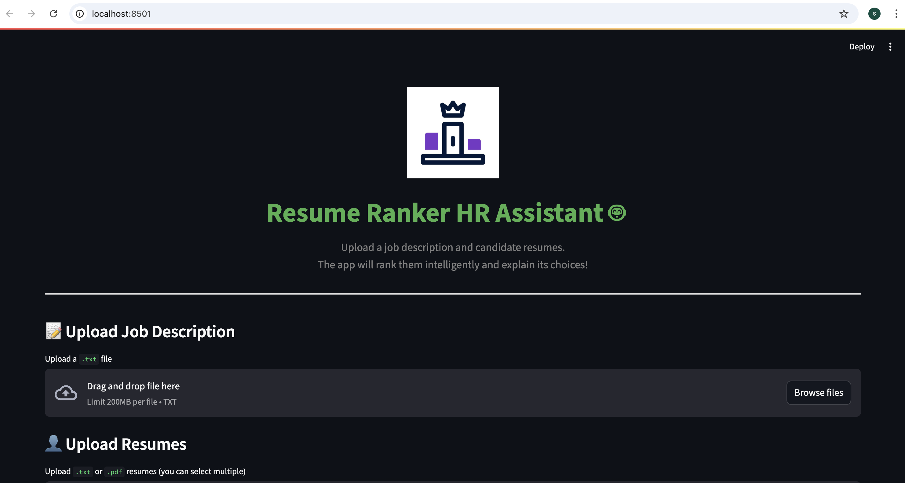
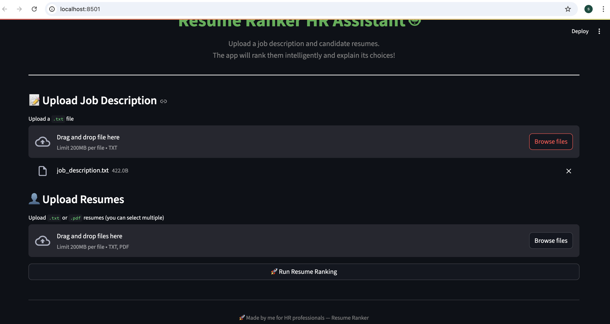
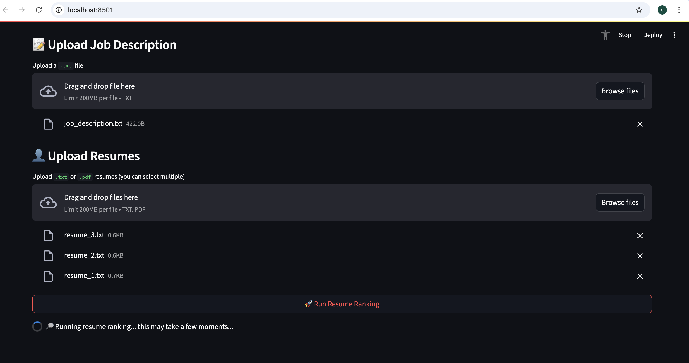
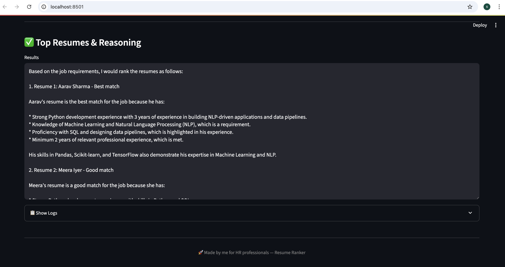
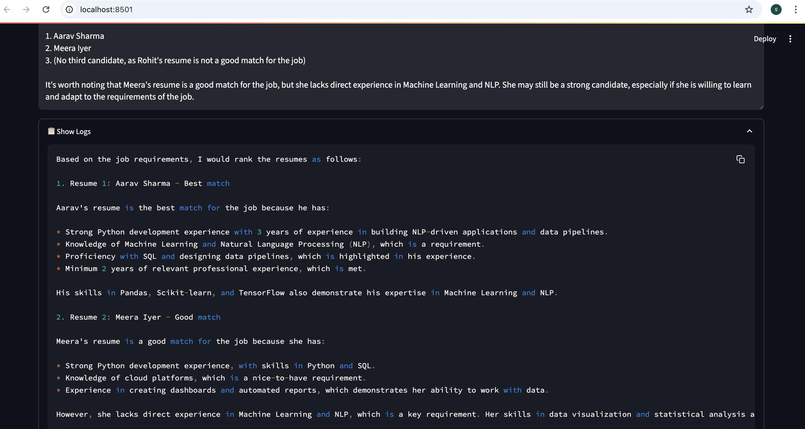

# 📄 Resume Screening Agent

> 🚀 A smart HR assistant that ranks resumes for a job description using LLMs & vector search — with a sleek web UI.

This project is a **Resume Ranking HR Assistant** 🧑‍💼 — it takes a **job description** and a set of **resumes**, embeds them into a vector store for semantic similarity search, and ranks the top resumes with an explanation.

✨ Features:
- Upload job description and multiple resumes (PDF & TXT)
- Vector-store-based similarity search to shortlist resumes
- Ranks and explains the top matches using a free/open LLM API
- Attractive Streamlit Web UI
- Clean UX — logs hidden on UI

---

## 📷 Screenshots

| Home Page | Ranking Results |
|-----------|----------------|
|  |  |  |  | | 

---

## 🎥 Demo Video

Here’s a quick demo of the Resume Screening Agent in action:  

[](https://youtu.be/IEBO5puya80)  

> 📺 *Click the thumbnail above or [watch here]([https://www.youtube.com/watch?v=your-video-id-here](https://www.youtube.com/watch?v=IEBO5puya80)).*

---

## 🛠️ Agent Architecture

Here is the architecture of the Resume Screening Agent:

                    +-----------------------+
                    | Job Description (.txt)|
                    +-----------------------+
                               |
                               v
                    +-----------------------+
                    |   Resumes (.pdf/.txt) |
                    +-----------------------+
                               |
                               v
                +---------------------------------+
                | RecursiveCharacterTextSplitter  |
                +---------------------------------+
                               |
                               v
                +---------------------------------+
                | HuggingFaceEmbeddings           |
                | (SentenceTransformers)          |
                +---------------------------------+
                               |
                               v
                +---------------------------------+
                | ChromaDB Vector Store           |
                +---------------------------------+
                               |
                               v
                +---------------------------------+
                | Similarity Search (Top K)       |
                +---------------------------------+
                               |
                               v
                +---------------------------------+
                | Free/Open LLM (Together.ai, etc)|
                +---------------------------------+
                               |
                               v
             => ✅ Ranks Resumes + Explains


---

## 📦 Tech Stack

| 🧰 Tool                    | Purpose                                |
|-----------------------------|----------------------------------------|
| **LangChain**              | Orchestration                         |
| **SentenceTransformers**   | Embedding resumes & JD                |
| **ChromaDB**               | Vector store for similarity search    |
| **Free/Open LLM APIs**     | Reasoning & ranking                   |
| **Streamlit**              | Web User Interface                    |
| **Python-dotenv**          | Secrets/environment variables         |

---

## 🚀 Setup

### Clone & Install
```bash
git clone https://github.com/yourname/Resume-Screening-Agent.git
cd Resume-Screening-Agent

python3 -m venv venv
source venv/bin/activate

pip install -r requirements.txt

Environment Variables
Create a .env file in the root directory:

env
TOGETHER_API_KEY=your_key_here
Replace your_key_here with your Together.ai (or other LLM) API key.

🖥️ Usage
Command-line Agent
bash
Copy
Edit
python rsagent.py
Streamlit Web UI
bash
Copy
Edit
streamlit run app.py
Then open the URL shown in terminal, usually: http://localhost:8501

🤝 Contributions
PRs welcome!
You can help by:

Improving the UI

Supporting more models

Optimizing the ranking logic

📄 License
MIT

⭐ If you like it, please star the repo!


---  
